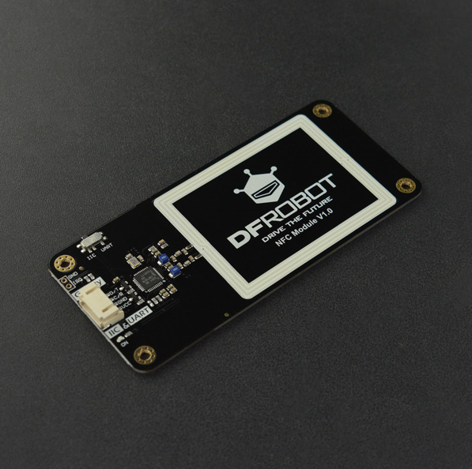

# DFRobot_PN532
 - [中文版](./README_CN.md)

The PN532 is a highly integrated transmission module for contactless communication at 13.56 MHz including microcontroller functionality based on an 80C51 core with 40 Kbytes of ROM and 1 Kbytes of RAM. 
The PN532 combines a modulation and demodulation concept completely integrated for different kinds of contactless communication methods and protocols at 13.56 MHz with an easy-to-use firmware for the different supported modes and the required host controller interfaces. 
This example is for pn532 chip reads and writes CARDS.



## Product Link (https://www.dfrobot.com/product-1917.html)
    SKU: DFR0231-H

## Table of Contents

* [Summary](#summary)
* [Installation](#installation)
* [Methods](#methods)
* [Support](#support)
* [Compatibility](#compatibility)
* [History](#history)
* [Credits](#credits)

## Summary
Provide an Arduino library to control the nfc module to get data from card and writes data  to card .


## Installation

To use this library, first download the library file, paste it into the \Arduino\libraries directory, then open the examples folder and run the demo in the folder.

## Methods

```C++	

   /*!
    * @fn readData
    * @brief Read a block from a MIFARE Classic NFC smart card/tag (16 bytes each block).
    * @param buffer The buffer of the read data.
    * @param block The number of the block to read from.
    * @return Status code. 
    * @retval 1 successfully read data
    * @retval -1 Failed to read data
    */   
   uint8_t readData(uint8_t *buffer,uint8_t block);

   /*!
    * @fn readData
    * @brief Read a byte from a specified block of a MIFARE Classic NFC smart card/tag.
    * @param block The number of the block to read from.
    * @param offset The offset of the block. 
    * @return A byte read from the card. 
    */  
   uint8_t readData(int block, uint8_t offset);

   /*!
    * @fn writeData
    * @brief Write a byte to a MIFARE Classic NFC smart card/tag.
    * @param block The number of pages you want to writes the data.
    * @param num The offset of the data. 
    * @param data The byte to be written.
    */  
   void writeData (int block, uint8_t num ,uint8_t data);

   /*!
    * @fn scan
    * @brief Scan to determine whether there is a NFC smart card/tag. 
    * @return Boolean type, the result of operation
    * @retval true means find out a MIFARE Classic card.
    * @retval false no card
    */ 
   bool  scan(void);

   /*!
    * @fn scan
    * @brief Scan to determine whether there is a NFC smart card/tag with the specified UID.
    * @param nfcuid UID of the NFC card.
    * @return Boolean type, the result of operation
    * @retval true Finds a card with a specific UID
    * @retval false The card with a specific UID was not found
    */   
   bool  scan(String nfcuid);

   /*!
    * @fn readUid
    * @brief Obtain the UID of the card .
    * @return UID of the card.
    */  
   String  readUid();

   /*!
    * @fn writeData
    * @brief Write a block to a MIFARE Classic NFC smart card/tag..
    * @param block The number of the block to write to.
    * @param data The buffer of the data to be written. 
    */  
   bool  writeData(int block, uint8_t data[]);

   /*!
    * @fn readUltralight
    * @brief Read a page from a MIFARE Ultralight NFC smart card/tag.
    * @param buffer The buffer of the read data. 
    * @param block The number of the block to read from.
    * @return Error or correct message code
    */
   uint8_t readUltralight(uint8_t *buffer,uint8_t block);

   /*!
    * @fn writeUltralight
    * @brief Write a page to a MIFARE Ultralight NFC smart card/tag.
    * @param block The number of the block to read from.
    * @param data The buffer of the read data. 
    * @return Boolean type, the result of operation
    * @retval true Write success
    * @retval false Write failed
    */
   bool  writeUltralight(int block, uint8_t data[]);

   /*!
    * @fn readNTAG
    * @brief Read a page from a NTAG.
    * @param buffer The buffer of the read data.
    * @param block The number of the block to read from.
    * @return Status code. 
    * @retval 1 successfully read data
    * @retval -1 Failed to read data
    */
   uint8_t readNTAG(uint8_t *buffer,uint8_t block);

   /*!
    * @fn writeNTAG
    * @brief Write a page to a NTAG.
    * @param block The number of the block to read from.
    * @param data The buffer of the read data. 
    * @return Boolean type, the result of operation
    * @retval true Write success
    * @retval false Write failed
    */
   bool  writeNTAG(int block, uint8_t data[]);

   /*!
    * @fn readData
    * @brief Read the basic information of a NFC smart card/tag. 
    * @return Info. of the sCard_t.
    */
   sCard_t getInformation();
	 
```
## Support
TYPE                | read and write   | Can be accurately identified？ | Remarks
------------------- | :--------------: | :----------------------------: |-----
Mifareclassic S50   |      √           |      √                         | 
Mifareclassic S70   |      √           |      √                         |                         
NTAG 213            |      √           |       √                         |        
NTAG 215            |      √           |       √                         |    
NTAG 216            |      √           |       √                         |          
Ultralight          |      √           |       √                         |           


## Compatibility

MCU                | Work Well    | Work Wrong   | Untested    | Remarks
------------------ | :----------: | :----------: | :---------: | -----
Arduino Uno        |      √       |              |             | 
Mega2560        |      √       |              |             | 
ESP32        |      √       |              |             | 
micro:bit         |      √       |              |             | 

## History


- 2019/10/15 - Version 1.0.0 released.


## Credits

Written by fengli(li.feng@dfrobot.com), 2020.7.31 (Welcome to our [website](https://www.dfrobot.com/))


